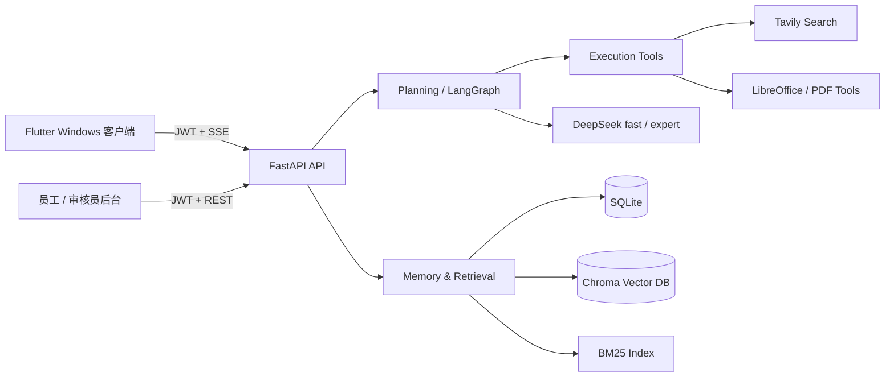

# 知天 Agent Platform

[](https://github.com/z987645344-arch/zhitian/actions/workflows/ci.yml)


**知天**是一套面向个人与小型团队的本地优先 AI Agent 平台。它把对话、企业知识库、联网检索、文件处理、任务分解、权限审核和运行诊断放进同一条可追踪链路，而不是停留在单轮聊天 Demo。

本仓库是系统后端；完整产品还包括 [Flutter Windows 客户端](https://github.com/z987645344-arch/zhitian_app) 和 [管理后台](https://github.com/z987645344-arch/zhitian_admin)。

## 为什么值得看

- **两档 Agent 能力**：fast 路径面向低延迟知识库与附件问答；expert 路径支持意图分类、联网搜索、复杂任务分解、文件生成与转换。
- **可审核的企业知识库**：员工上传，审核员批准后才进入 verified 检索范围；支持 BM25 + 向量 Hybrid Search、标题补充召回与模型批量重排序。
- **完整文件工作流**：聊天附件阅读、统一个人文件库、TXT/MD/PDF/DOCX 预览、Office/PDF 转换、PDF 合并拆分、Agent 生成 MD/TXT/PDF/DOCX。
- **不是黑盒调用**：每次请求生成 `trace_id`，记录阶段耗时、模型错误分类、fast/expert 分位延迟和最近请求明细。
- **面向真实故障设计**：SSE 心跳、搜索透明降级、复杂任务全局 deadline、优雅关闭、上传大小/扩展名/文件特征校验。

## 系统架构



### 请求模式

| 模式 | 定位 | 能力边界 |
|---|---|---|
| `fast` | 日常低延迟 | 上下文对话、知识库检索、文档清单、聊天附件阅读；最多两次模型调用，不联网、不生成文件 |
| `expert` | 完整 Agent | 意图分类、联网搜索、复杂任务分解、决策理由、文件生成、附件格式转换 |

## 核心模块

| 模块 | 职责 |
|---|---|
| `layers/planning.py` | fast/expert 路由、LangGraph 状态机、ReAct 与复杂任务链 |
| `layers/memory.py` | 短期历史、长期记忆、重要性评估、遗忘、Hybrid Search 与重排序 |
| `layers/execution.py` | 搜索、知识库、文件生成和格式转换等工具执行 |
| `layers/llm_provider.py` | DeepSeek OpenAI 兼容调用、超时重试和错误分类 |
| `layers/files_store.py` | SQLite 元数据 + 磁盘文件的用户级持久化文件库 |
| `layers/converter.py` | LibreOffice 转换与 PDF 反向尽力重建 |
| `utils/observability.py` | trace、计数器、最近请求和 P50/P95/P99 |
| `layers/mcp_connector.py` | 外部 stdio MCP server 的隔离连接层，尚未接入生产工具路由 |

## 权限与数据边界

| 角色 | 主要权限 |
|---|---|
| `customer` | 对话、附件、个人文件与工具箱 |
| `employee` | 上传企业文档、录入知识、查看本人提交 |
| `reviewer` | 审核/拒绝文档、管理 verified 知识库、检索调试、运行指标 |

- JWT 鉴权和角色校验覆盖受保护接口。
- 非文件 owner 的下载、预览和删除统一按不存在处理，避免暴露资源存在性。
- `.env`、`data/`、向量库和运行日志均被 Git 忽略；日志不记录 prompt、附件正文或 API Key。
- 上传默认限制 `20MB`，并校验扩展名与文件特征。

## 快速运行

### 1. 环境

- Windows 10/11
- Python 3.10
- LibreOffice（Office/PDF 转换需要）
- DeepSeek API Key；联网搜索另需 Tavily API Key

### 2. 安装

```powershell
git clone https://github.com/z987645344-arch/zhitian.git
cd zhitian
py -3.10 -m venv .venv
.\.venv\Scripts\python.exe -m pip install -r requirements.txt
```

### 3. 配置

创建 UTF-8 无 BOM 的 `.env`：

```env
DEEPSEEK_API_KEY=replace-with-your-key
DEEPSEEK_FAST_MODEL=deepseek-v4-flash
DEEPSEEK_EXPERT_MODEL=deepseek-v4-pro
TAVILY_API_KEY=replace-with-your-key
JWT_SECRET_KEY=replace-with-at-least-32-random-bytes
LIBREOFFICE_PATH=C:\Program Files\LibreOffice\program\soffice.exe
```

### 4. 启动

```powershell
.\.venv\Scripts\python.exe main.py
```

服务默认监听 `http://localhost:8000`：

- `GET /health`：进程存活
- `GET /ready`：SQLite 与 Chroma 依赖就绪
- `POST /auth/register`：注册测试账号
- `POST /chat/stream`：SSE 对话主入口

## 推荐评审路径

1. 注册 `employee` 和 `reviewer`，上传一份文档并完成审核。
2. 在 Flutter 客户端分别用 fast/expert 提问，观察引用来源和决策理由差异。
3. 上传聊天附件并要求总结；再生成一份 PDF/DOCX 交付文件。
4. 在工具箱完成 PDF 合并/拆分或 Office 转换。
5. 打开审核员开发者视图，通过同一 `trace_id` 查看请求阶段耗时。

## 质量证据

- 后端完整本地回归：**186 passed**。
- GitHub Actions 在 Windows 目标环境执行依赖安装、敏感文件检查、全量语法检查和离线测试。
- v1.0 至 v1.9 保留连续里程碑标签，详细演进见 [CHANGELOG.md](CHANGELOG.md)。

## 已知边界

- 当前是单实例本地部署：进程内指标与附件文本 TTL 不跨 worker 聚合。
- PDF 转 Word/Excel/PPT 是尽力重建，不提供扫描件 OCR 或复杂版式无损保证。
- 外部 MCP 通用连接层已验证，但尚未暴露给生产 Agent 工具路径。
- 数据层仍以 SQLite + Chroma 为主，大规模多租户部署需迁移数据库和对象存储。

## 关联仓库

- [zhitian_app](https://github.com/z987645344-arch/zhitian_app)：Flutter Windows 客户端
- [zhitian_admin](https://github.com/z987645344-arch/zhitian_admin)：员工与审核员管理后台

## License

当前仓库未附带开源许可证，默认保留全部权利；公开复用前请先联系项目作者。
