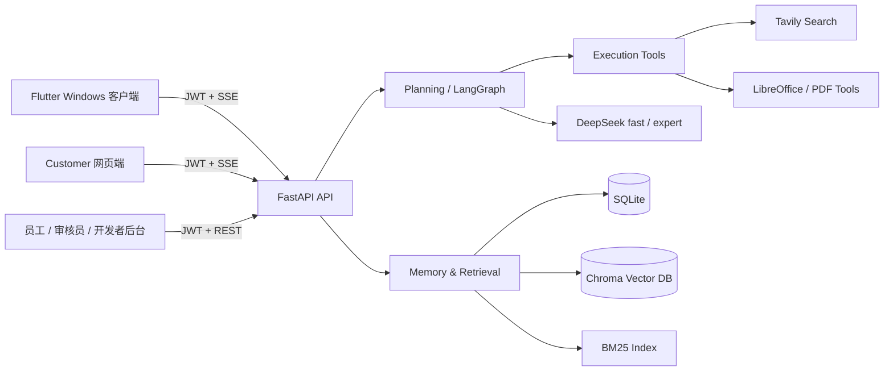

# 知天 Agent Platform

[](https://github.com/z987645344-arch/zhitian/actions/workflows/ci.yml)


**知天**是一套面向个人与小型团队的本地优先 AI Agent 平台。它把对话、企业知识库、联网检索、文件处理、任务分解、权限审核和运行诊断放进同一条可追踪链路，而不是停留在单轮聊天 Demo。

本仓库是系统后端，并包含customer静态网页端`web_client/`；完整产品还包括
[Flutter Windows 客户端](https://github.com/z987645344-arch/zhitian_app)、
[管理后台](https://github.com/z987645344-arch/zhitian_admin)和独立的
[Docker Compose部署仓库](https://github.com/z987645344-arch/zhitian-deploy)。

## 为什么值得看

- **两档 Agent 能力**：fast 路径面向低延迟知识库与附件问答；expert 路径支持意图分类、联网搜索、复杂任务分解、文件生成与转换。
- **可审核的企业知识库**：员工上传，审核员批准后才进入 verified 检索范围；支持 BM25 + 向量 Hybrid Search、标题补充召回与模型批量重排序。
- **完整文件工作流**：聊天附件阅读、统一个人文件库、TXT/MD/PDF/DOCX 预览、Office/PDF 转换、PDF 合并拆分、Agent 生成 MD/TXT/PDF/DOCX。
- **不是黑盒调用**：每次请求生成 `trace_id`，记录阶段耗时、模型错误分类、fast/expert 分位延迟和最近请求明细。
- **面向真实故障设计**：SSE 心跳、搜索透明降级、复杂任务全局 deadline、优雅关闭、上传大小/扩展名/文件特征校验。

## 系统架构



### 请求模式

| 模式 | 定位 | 能力边界 |
|---|---|---|
| `fast` | 日常低延迟 | 上下文对话、知识库检索、文档清单、聊天附件阅读；无工具时 1 次模型调用，文档证据不足 2 次、证据充分最多 3 次，不联网、不生成文件 |
| `expert` | 完整 Agent | 意图分类、联网搜索、复杂任务分解、决策理由、文件生成、附件格式转换 |

## 核心模块

| 模块 | 职责 |
|---|---|
| `layers/planning.py` | fast/expert 路由、LangGraph 状态机、ReAct 与复杂任务链 |
| `layers/memory.py` | 短期历史、长期记忆、重要性评估、遗忘、Hybrid Search 与重排序 |
| `layers/execution.py` | 搜索、知识库、文件生成和格式转换等工具执行 |
| `layers/llm_provider.py` | DeepSeek OpenAI 兼容调用、超时重试和错误分类 |
| `layers/organizations.py` | 组织目录、加入/退出审批、成员范围与大厅静态内容 |
| `layers/files_store.py` | SQLite 元数据 + 磁盘文件的用户级持久化文件库 |
| `layers/converter.py` | LibreOffice 转换与 PDF 反向尽力重建 |
| `utils/observability.py` | trace、计数器、最近请求和 P50/P95/P99 |
| `layers/mcp_connector.py` | 外部 stdio MCP server 的隔离连接层，尚未接入生产工具路由 |

## 权限与数据边界

| 角色 | 主要权限 |
|---|---|
| `customer` | 对话、附件、个人文件与工具箱 |
| `employee` | 上传企业文档、录入知识、查看本人提交 |
| `reviewer` | 在所属组织内审核/拒绝文档、管理verified知识库、检索调试、查看文档调用量、审批员工账号与员工组织申请 |
| `developer` | 账号治理与人员概览、组织管理、审核员组织申请审批、企业密码查看与刷新、系统提示词模块编辑、按角色限流、大厅内容维护、邮件发送量与运行指标监控 |

### 组织体系

企业角色以组织为单位划分工作范围：「默认」组织是全员自动加入的大厅，承载公司级静态信息；自定义组织为功能群，加入和退出都需要审批（员工由本组织审核员批准，审核员由开发者批准）。员工与审核员必须至少加入一个自定义组织才能上传或审核文档，文档按归属组织在管理端隔离可见性——**客户端检索链路不受组织范围限制，始终面向全部 verified 文档**。

- JWT 鉴权和角色校验覆盖受保护接口。
- 非文件 owner 的下载、预览和删除统一按不存在处理，避免暴露资源存在性。
- `.env`、`data/`、向量库和运行日志均被 Git 忽略；日志不记录 prompt、附件正文或 API Key。
- 上传默认限制`5MB`，正文切分后最多`2,000`个片段，并校验扩展名与文件特征；内容密集的大文件可能先触发片段数护栏。

## 快速运行

### 1. 环境

- Windows 10/11
- Python 3.10
- LibreOffice（Office/PDF 转换需要）
- DeepSeek API Key；联网搜索另需 Tavily API Key
- 阿里云 DirectMail AccessKey（可选，仅邮箱验证码功能需要）

### 2. 安装

```powershell
git clone https://github.com/z987645344-arch/zhitian.git
cd zhitian
py -3.10 -m venv .venv
.\.venv\Scripts\python.exe -m pip install -r requirements.txt
```

### 3. 配置

以仓库中的`.env.example`为唯一配置项清单，复制为UTF-8无BOM的`.env`后，
按每项注释填写本机开发值：

```powershell
Copy-Item .env.example .env
```

不要在README中维护第二套配置变量列表；新增或删除环境变量时只更新`.env.example`
及对应生产配置文档。`.env`不得进入Git或镜像。

`ENTERPRISE_PASSWORD_SEED`未配置时应用会直接拒绝启动；`JWT_SECRET_KEY`未配置时登录与鉴权会返回明确的配置错误。

DirectMail 三项凭据（`ALIYUN_ACCESS_KEY_ID`、`ALIYUN_ACCESS_KEY_SECRET`、`ALIYUN_MAIL_REGION_ID`）用于发送邮箱验证码。**任一项为空时，验证码发送接口会返回明确的「邮件发送服务暂不可用」错误，但不影响系统其他部分运行**——对话、知识库、文件工作流和已有账号登录均照常可用，只是无法完成需要验证码的注册申请与密码重置。`CORS_ORIGINS` 需要包含管理后台的实际来源，否则浏览器端调用会被拦截。

### 4. 启动

```powershell
.\.venv\Scripts\python.exe main.py
```

服务默认监听 `http://localhost:8000`：

- `GET /health`：进程存活
- `GET /ready`：SQLite、Chroma与LibreOffice依赖就绪
- `POST /auth/register`：注册测试账号
- `POST /chat/stream`：SSE 对话主入口

### 5. 测试

Windows 本地和 GitHub Actions 均以根目录脚本作为唯一测试入口：

```powershell
.\run_tests.bat -q
```

脚本默认排除`integration`标记；需要单独运行真实集成测试时使用
`.\run_tests.bat -m integration`。不要直接调用`python -m pytest`，也不要使用
“系统Python + `.venv` site-packages”的替代方式；测试收集阶段会校验解释器必须是
项目`.venv`中的Python 3.10，避免MCP子进程环境隔离产生假性失败。

## 推荐评审路径

1. 在管理后台申请 `employee` 与 `reviewer` 账号并完成审批，各自加入同一个自定义组织，再上传一份文档并完成审核。
2. 在 Flutter 客户端分别用 fast/expert 提问，观察引用来源和决策理由差异。
3. 上传聊天附件并要求总结；再生成一份 PDF/DOCX 交付文件。
4. 在工具箱完成 PDF 合并/拆分或 Office 转换。
5. 登录独立的开发者工作台，通过同一`trace_id`查看请求阶段耗时。

## 质量证据

- 后端最近完整权威回归：**403 passed, 5 deselected**（`.\run_tests.bat -q`，默认排除 integration 标记）。
- GitHub Actions 在 Windows 目标环境执行依赖安装、敏感文件检查、全量语法检查和离线测试。
- 当前稳定标签为`v3.4`；其后的纯文档整理提交不改变运行代码。历史里程碑及完整演进见[CHANGELOG.md](CHANGELOG.md)。

## 已知边界

- 当前生产基线是Docker Compose单后端实例；进程内指标与附件文本TTL不跨worker或实例聚合。
- PDF 转 Word/Excel/PPT 是尽力重建，不提供扫描件 OCR 或复杂版式无损保证。
- 外部 MCP 通用连接层已验证，但尚未暴露给生产 Agent 工具路径。
- 数据层仍以 SQLite + Chroma 为主，大规模多租户部署需迁移数据库和对象存储。

## 关联仓库

- [zhitian_app](https://github.com/z987645344-arch/zhitian_app)：Flutter Windows 客户端
- [zhitian_admin](https://github.com/z987645344-arch/zhitian_admin)：员工 / 审核员 / 开发者三角色管理后台
- [zhitian-deploy](https://github.com/z987645344-arch/zhitian-deploy)：Docker Compose、统一反向代理与运行时部署配置

## License

当前仓库未附带开源许可证，默认保留全部权利；公开复用前请先联系项目作者。
